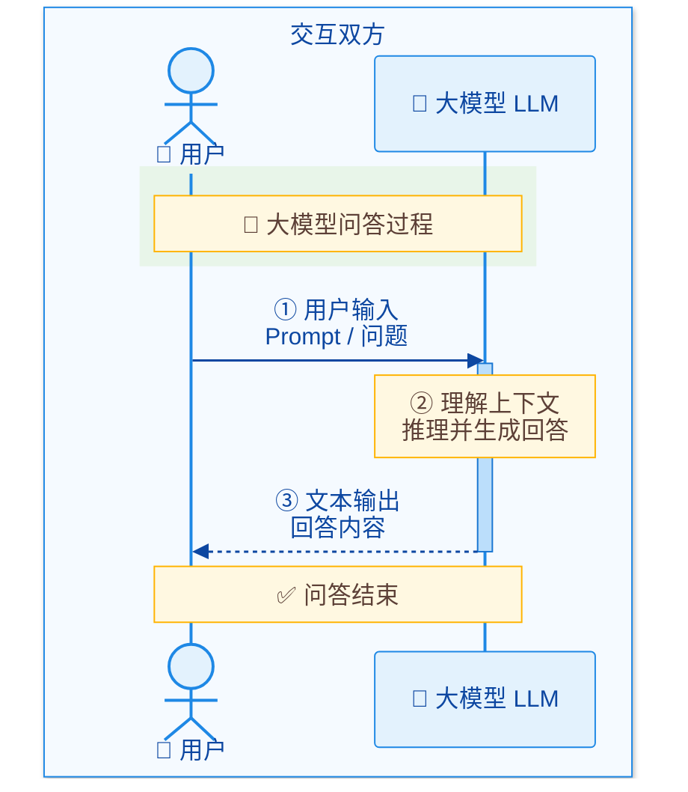
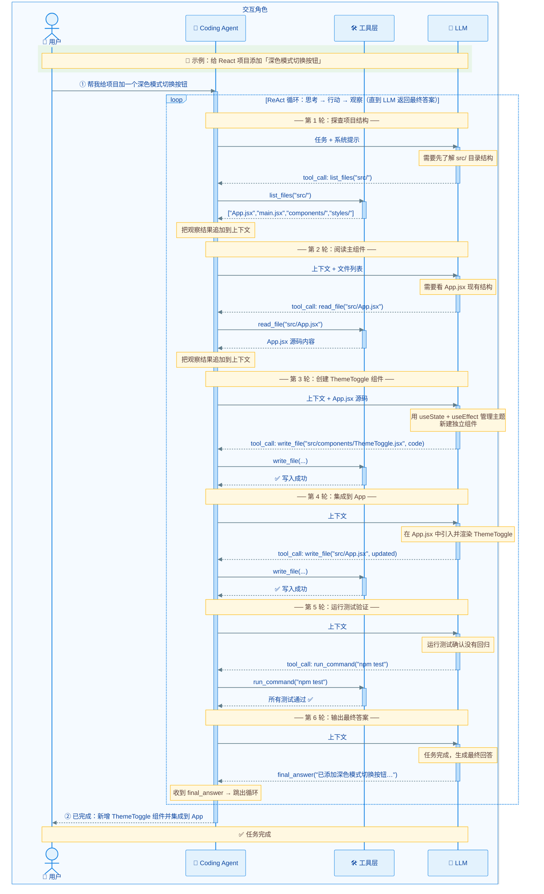
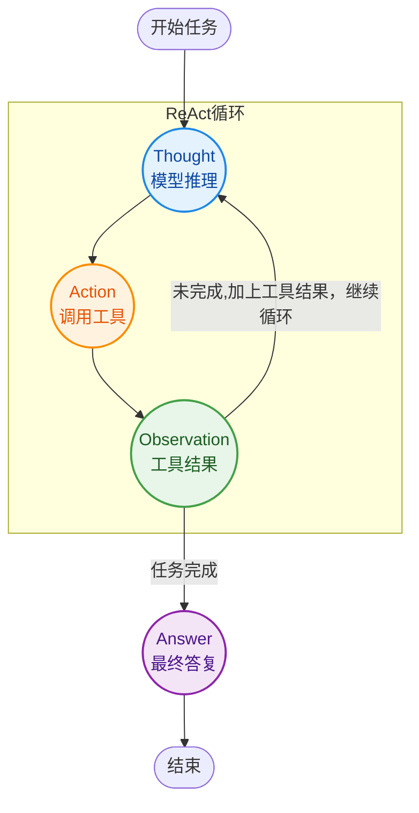
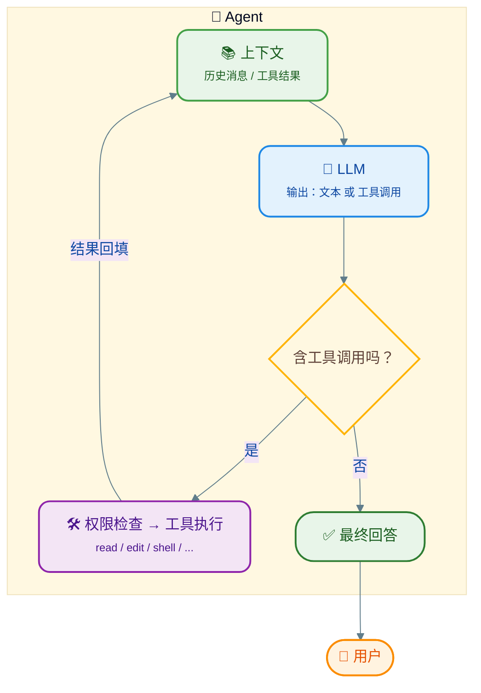

[TOC]

# 手搓Coding Agent - 工作原理

## 概述

在日常的工作生活中，相信大家已经经常接触大模型了（LLM），以豆包举例，我们会在输入框中输入我们想问的问题，豆包会给我们解答。这个过程基本就是一问一答，如下：



而对比于Agent，最大的区别就是同样是使用LLM，Agent还会帮我们干更多的活，比如编写代码，查看文件等等，而且这个过程，会有多次操作（比如查看文件后，再找到对应的位置，再编写代码），如下：



> 注意：这里把工具和Agent拆开了，实际上很多Agent本身就提供了工具能力，但是也可以通过MPC（后续会单独说明）等方式去调用其他工具提供者，所以我们这里把它拆开

上面的流程比较复杂，我们简单的总结一下其实就是：

```
用户输入 → [LLM 思考] → 决定调工具 → agent执行工具 → agent结果回填
         → [LLM 再思考] → agent再调工具 → ...
         → [LLM 判断任务完成] → 输出最终回答 → 结束
```

从上述流程来看，Agent与普通的大模型问答最大区别在于两点：**循环**和**行动能力**。

> Agent执行一个任务的过程，LLM就像一个大脑，Agent就像人的四肢，在完成这项任务期间，大脑（LLM）会根据任务的目标做出思考，然后协调四肢（工具）去完成一些工作并得到对应结果，并根每次（或多次）事情的结果，来决定一下步的行动，直至大脑判定任务结束。

## ReAct

上述的流程，有一个专有的名词，叫做ReAct（Reasoning + Acting），它包含：模型推理，再行动，行动结果给下一轮推理。具体关键环节如下：

| 角色            | 说明             | Coding Agent 里的例子                               |
| --------------- | ---------------- | --------------------------------------------------- |
| **Thought**     | 模型的推理       | "我需要先看看 `src/main.rs` 第 42 行代码是干什么的" |
| **Action**      | 决定调用某个工具 | `read_file({"path": "src/main.rs"})`                |
| **Observation** | 工具执行结果     | 文件内容（带行号）                                  |
| **Answer**      | 最终答复         | "43行的代码主要用于xxxx"                            |

流程如下：



这个过程如果用代码来描述的话（伪代码）：

```

loop:
    output = LLM(历史消息 + 工具清单)
    if output 是最终回答:
        return output                     # 模型自己决定结束
    if output 是工具调用:
        result = 执行工具(output.name, output.args)
        把 result 追加到历史消息            # Observation 回填
```

整个流程中有两个点很重要：

1. 循环终止由模型决定，Agent的工作是判定模型有没有决策循环终止（注意这是正常流程，但是Agent本身也会根据安全阈来判定要不要结束）
2. 模型本身不能执行任何操作，而是告诉Agent，需要它做什么工作（这里的当然有个前提，Agent告诉了模型自己有哪些工具）

## 工具

前面有个很重要的概念：工具

所谓的工具，就是Aegent具备的能力，这些能力需要被模型知晓，模型在必要的时候，会让Agent去执行摸个工具。工具的调用过程有一下的要素：

1. **工具描述**：工具描述用于说明工具能干嘛，需要哪些参数，Agent必须将工具列表告诉模型，让模型知道自己能干嘛
2. **模型决策**：模型决定需要使用哪个工具的时候，会按照工具描述准备对应的参数和名称，然后告诉Agent去执行
3. **工具执行**：Agent的在拿到入参执行工具后，会将执行的结果追加到消息列表中，然后向大模型发起请求

## 上下文

我们在说明工具的时候，有提到工具执行结果的追加，这里为什么是追加而不是直接用结果发起请求呢？

这个是因为大模型并不具备记忆能力，一次请求，我们必须将之前的交互结果一起提交各大模型，它才知道之前发生了什么，这个过程，我们称之为上下文。

这里的交互结果主要包括了：

- 用户要求
- 工具的执行指令（模型响应里得到）
- 工具的执行结果（agent执行得到）

这些内容的不断增加，会导致上下文越来越大（我们经常听到的模型的上下文是512K，1M，其实就是指这个）。

## Coding Agent 工作的完整流程



