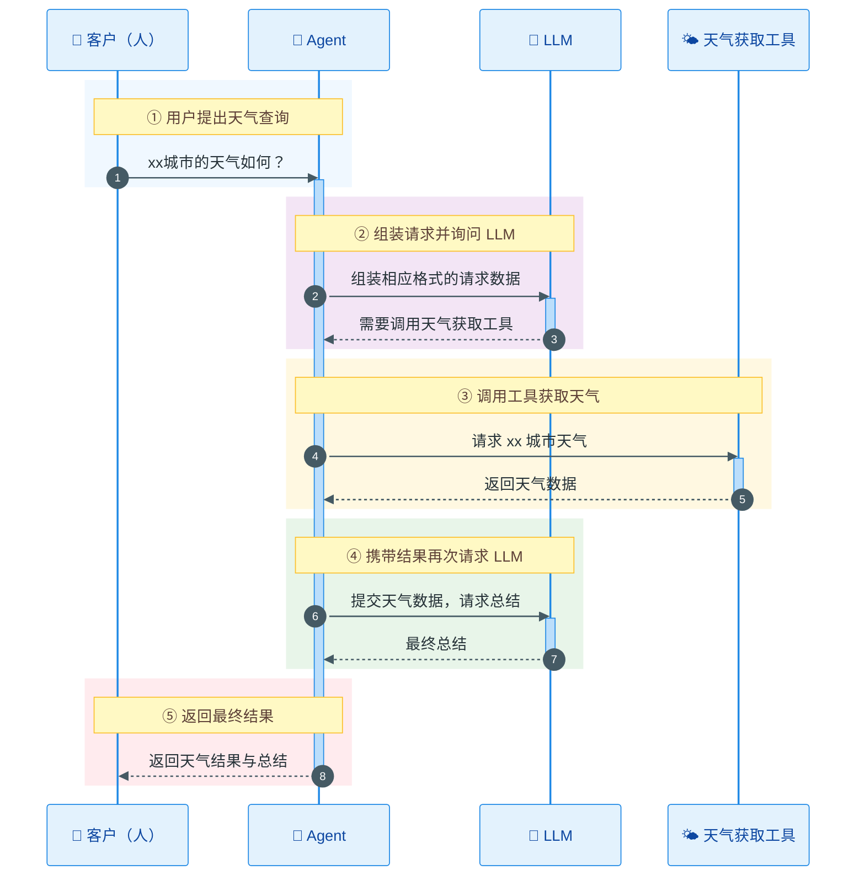

[TOC]


# 手搓Coding Agent - LLM请求协议的统一

## 概述

前面我们已经说过，无论我们的agent的事怎么工作的，本质的工作还是和LLM进行交互。到目前为止，最流行的交互方式还是通过HTTP请求。但是前面我们也说了，我们不仅仅是跟LLM对话，还涉及到行为的交互——Agent需要告诉LLM我能干什么（有哪些工具），LLM告诉Agent需要你使用哪个工具干活。

这样的话简单的纯文本交互就不好用了，我们需要更复杂的约定（协议）。目前市面上最常用的LLM交互协议有三种：OpenAI Chat Completion，OpenAI Responses和Anthropic协议。

关于这三种协议的来龙去脉我这里就不做过的展开，之说一点：这三种协议的本质上还是通过组装不同的JSON格式数据，来完成和LLM的交互。

## 请求协议分析

接下来，我们通过一个经典的需求，来看看三个协议。本次需如下：

1. 我们的Agent的有一个工具可以通过输入城市名称，获取当前城市天气
2. Agent需要在用户询问具体城市天气的时候，通过LLM来完成回答。

交互的具体的流程如下



注意上述图中 2-> 3，6->7分别两次和LLM的交互：获取天气（携带工具说明）-> LLM返回，天气结果 -> LLM返回，我们来看看在不同的协议里，这些请求是啥样子的。

### OpenAI Chat Completions

#### 第2步 获取天气请求

```json
{
  "model": "deepseek-flash",
  "stream": false, 
  "temperature": 0.7, 
  "messages": [
    {
      "content": "you are a helpful asistant.",
      "role": "system"
    },
    {
      "role": "user",
      "content": "北京今天天气怎么样？"
    }
  ],
  "tools": [
    {
      "type": "function",
      "function": {
        "name": "get_weather",
        "description": "获取指定城市的当前天气信息",
        "parameters": {
          "type": "object",
          "properties": {
            "location": {
              "type": "string",
              "description": "城市名称，例如：北京"
            },
            "unit": {
              "type": "string",
              "enum": ["celsius", "fahrenheit"],
              "description": "温度单位，默认为摄氏度"
            }
          },
          "required": ["location"],
          "additionalProperties": false
        },
        "strict": true
      }
    }
  ],
  "tool_choice": "auto"
}
```

#### 第3步 LLM返回

```json
{
    "id": "873c6e2b-9bf3-482b-b554-6ca856dbb301",
    "object": "chat.completion",
    "created": 1789718211,
    "model": "deepseek-flash",
    "choices": [
        {
            "index": 0,
            "message": {
                "role": "assistant",
                "content": "",
                "reasoning_content": "The user is asking about Beijing's weather today. I should call the weather tool.",
                "tool_calls": [
                    {
                        "index": 0,
                        "id": "call_00_xFY6bA86S6CRHdhtNKBS6186",
                        "type": "function",
                        "function": {
                            "name": "get_weather",
                            "arguments": "{\"location\": \"北京\", \"unit\": \"celsius\"}"
                        }
                    }
                ]
            },
            "logprobs": null,
            "finish_reason": "tool_calls"
        }
    ],
    "usage": {
        "prompt_tokens": 348,
        "completion_tokens": 73,
        "total_tokens": 421,
        "prompt_tokens_details": {
            "cached_tokens": 0
        },
        "completion_tokens_details": {
            "reasoning_tokens": 17
        },
        "prompt_cache_hit_tokens": 0,
        "prompt_cache_miss_tokens": 348
    },
    "system_fingerprint": "aeb56401ca74e127821c4f9126dcb669"
}
```

#### 第6步 携带工具结果请求

```json
{
    "model": "deepseek-flash",
    "messages": [
      {
        "content": "you are a helpful asistant.",
        "role": "system"
      },
      {
        "role": "user",
        "content": "北京今天天气怎么样？"
      },
      {
        "role": "assistant",
        "content": "",
        "tool_calls": [
          {
            "id": "call_00_xFY6bA86S6CRHdhtNKBS6186",
            "type": "function",
            "function": {
              "name": "get_weather",
              "arguments": "{\"location\": \"北京\"}"
            }
          }
        ]
      },
      {
        "role": "tool",
        "tool_call_id": "call_00_xFY6bA86S6CRHdhtNKBS6186",
        "content": "北京今天晴，气温 25°C。"
      }
    ],
    "tools": [
      {
        "type": "function",
        "function": {
          "name": "get_weather",
          "description": "获取指定城市的天气信息",
          "parameters": {
            "type": "object",
            "properties": {
              "location": {
                "type": "string",
                "description": "城市名称，例如：北京"
              }
            },
            "required": ["location"]
          }
        }
      }
    ],
    "tool_choice": "auto",
    "stream": false
  }
```

#### 第7步 LLM返回

```json
{
    "id": "41da0dad-c6ea-4cc3-8cc1-cb8878c7d11e",
    "object": "chat.completion",
    "created": 1789718488,
    "model": "deepseek-flash",
    "choices": [
        {
            "index": 0,
            "message": {
                "role": "assistant",
                "content": "北京今天天气晴朗，气温约 25°C，比较舒适，适合外出活动。",
                "reasoning_content": ""
            },
            "logprobs": null,
            "finish_reason": "stop"
        }
    ],
    "usage": {
        "prompt_tokens": 381,
        "completion_tokens": 20,
        "total_tokens": 401,
        "prompt_tokens_details": {
            "cached_tokens": 0
        },
        "completion_tokens_details": {
            "reasoning_tokens": 0
        },
        "prompt_cache_hit_tokens": 0,
        "prompt_cache_miss_tokens": 381
    },
    "system_fingerprint": "aeb56401ca74e127821c4f9126dcb669"
}
```

请求中出现过的重要字段：model，stream，tool_choice，temperature，**messages**，**tools**。

响应中出现过的重要字段：model，**choices**，**usage**。

### OpenAI Responses

#### 第2步 获取天气请求

```json
{
  "model": "deepseek-flash",
  "instructions": "you are a helpful asistant.",
  "input": [
    {
      "role": "user",
      "content": [
        {
          "type": "input_text",
          "text": "北京今天天气怎么样？"
        }
      ]
    }
  ],
  "tools": [
    {
      "type": "function",
      "name": "get_weather",
      "description": "获取指定城市的当前天气信息",
      "parameters": {
        "type": "object",
        "properties": {
          "location": {
            "type": "string",
            "description": "城市名称，例如：北京"
          },
          "unit": {
            "type": "string",
            "enum": ["celsius", "fahrenheit"],
            "description": "温度单位，默认为摄氏度"
          }
        },
        "required": ["location"],
        "additionalProperties": false
      },
      "strict": true
    }
  ],
  "tool_choice": "auto",
  "stream": false,
  "temperature": 0.7
}
```

#### 第3步 LLM返回

```json
{
    "id": "9340a200-98ec-4c80-9be9-e793a3450f1d",
    "object": "response",
    "created_at": 1789719782,
    "status": "completed",
    "background": false,
    "completed_at": 1789719783,
    "content_filters": null,
    "error": null,
    "frequency_penalty": 0.0,
    "incomplete_details": null,
    "instructions": "you are a helpful asistant.",
    "max_output_tokens": null,
    "max_tool_calls": null,
    "model": "deepseek-flash",
    "moderation": null,
    "output": [
        {
            "type": "reasoning",
            "id": "b7156ea2-75be-43f0-8db8-0fa95545226f",
            "status": "completed",
            "content": [
                {
                    "type": "reasoning_text",
                    "text": "The user asks about Beijing weather today. Let me call the weather tool."
                }
            ],
            "summary": [],
            "encrypted_content": "9340a200-98ec-4c80-9be9-e793a3450f1d-0"
        },
        {
            "type": "function_call",
            "id": "96045351-6c16-4956-910d-0777f9859b58",
            "status": "completed",
            "arguments": "{\"location\": \"北京\", \"unit\": \"celsius\"}",
            "call_id": "call_00_7gXOfrxB2WIoK3I8qqRa1147",
            "name": "get_weather"
        }
    ],
    "parallel_tool_calls": true,
    "presence_penalty": 0.0,
    "previous_response_id": null,
    "prompt_cache_key": null,
    "prompt_cache_retention": null,
    "reasoning": {
        "effort": null,
        "summary": null
    },
    "safety_identifier": null,
    "service_tier": "default",
    "store": false,
    "temperature": 0.7,
    "text": {
        "format": {
            "type": "text"
        },
        "verbosity": null
    },
    "tool_choice": "auto",
    "tools": [
        {
            "type": "function",
            "name": "get_weather",
            "description": "获取指定城市的当前天气信息",
            "parameters": {
                "type": "object",
                "properties": {
                    "location": {
                        "type": "string",
                        "description": "城市名称，例如：北京"
                    },
                    "unit": {
                        "type": "string",
                        "enum": [
                            "celsius",
                            "fahrenheit"
                        ],
                        "description": "温度单位，默认为摄氏度"
                    }
                },
                "required": [
                    "location"
                ],
                "additionalProperties": false
            },
            "strict": true
        }
    ],
    "top_logprobs": 0,
    "top_p": 1.0,
    "truncation": "disabled",
    "usage": {
        "input_tokens": 348,
        "input_tokens_details": {
            "cached_tokens": 128
        },
        "output_tokens": 71,
        "output_tokens_details": {
            "reasoning_tokens": 15
        },
        "total_tokens": 419
    },
    "user": null,
    "metadata": {}
}
```

#### 第6步 携带工具结果请求

```json
{
  "model": "deepseek-flash",
  "instructions": "you are a helpful asistant.",
  "input": [
    {
      "role": "user",
      "content": [
        {
          "type": "input_text",
          "text": "北京今天天气怎么样？"
        }
      ]
    },
    {
      "type": "function_call",
      "call_id": "call_00_7gXOfrxB2WIoK3I8qqRa1147",
      "name": "get_weather",
      "arguments": "{\"location\": \"北京\", \"unit\": \"celsius\"}"
    },
    {
      "type": "function_call_output",
      "call_id": "call_00_7gXOfrxB2WIoK3I8qqRa1147",
      "output": "{\"location\": \"北京\", \"temperature\": 25, \"unit\": \"celsius\", \"condition\": \"晴\"}"
    }
  ],
  "tools": [
    {
      "type": "function",
      "name": "get_weather",
      "description": "获取指定城市的当前天气信息",
      "parameters": {
        "type": "object",
        "properties": {
          "location": {
            "type": "string",
            "description": "城市名称，例如：北京"
          },
          "unit": {
            "type": "string",
            "enum": ["celsius", "fahrenheit"],
            "description": "温度单位，默认为摄氏度"
          }
        },
        "required": ["location"],
        "additionalProperties": false
      },
      "strict": true
    }
  ],
  "tool_choice": "auto",
  "stream": false,
  "temperature": 0.7
}
```

#### 第7步 LLM返回

```json
{
    "id": "e9e857f7-f524-48ac-9221-baf3e879b6fc",
    "object": "response",
    "created_at": 1789719912,
    "status": "completed",
    "background": false,
    "completed_at": 1789719913,
    "content_filters": null,
    "error": null,
    "frequency_penalty": 0.0,
    "incomplete_details": null,
    "instructions": "you are a helpful asistant.",
    "max_output_tokens": null,
    "max_tool_calls": null,
    "model": "deepseek-flash",
    "moderation": null,
    "output": [
        {
            "type": "message",
            "id": "bd24a6d4-2486-44c6-96a0-abef9948e150",
            "status": "completed",
            "content": [
                {
                    "type": "output_text",
                    "annotations": [],
                    "logprobs": [],
                    "text": "北京今天天气晴朗，气温约 **25°C**，体感比较舒适。适合外出活动，不过早晚温差可能较大，建议适当增减衣物。☀️"
                }
            ],
            "phase": "final_answer",
            "role": "assistant"
        }
    ],
    "parallel_tool_calls": true,
    "presence_penalty": 0.0,
    "previous_response_id": null,
    "prompt_cache_key": null,
    "prompt_cache_retention": null,
    "reasoning": {
        "effort": null,
        "summary": null
    },
    "safety_identifier": null,
    "service_tier": "default",
    "store": false,
    "temperature": 0.7,
    "text": {
        "format": {
            "type": "text"
        },
        "verbosity": null
    },
    "tool_choice": "auto",
    "tools": [
        {
            "type": "function",
            "name": "get_weather",
            "description": "获取指定城市的当前天气信息",
            "parameters": {
                "type": "object",
                "properties": {
                    "location": {
                        "type": "string",
                        "description": "城市名称，例如：北京"
                    },
                    "unit": {
                        "type": "string",
                        "enum": [
                            "celsius",
                            "fahrenheit"
                        ],
                        "description": "温度单位，默认为摄氏度"
                    }
                },
                "required": [
                    "location"
                ],
                "additionalProperties": false
            },
            "strict": true
        }
    ],
    "top_logprobs": 0,
    "top_p": 1.0,
    "truncation": "disabled",
    "usage": {
        "input_tokens": 456,
        "input_tokens_details": {
            "cached_tokens": 256
        },
        "output_tokens": 37,
        "output_tokens_details": {
            "reasoning_tokens": 0
        },
        "total_tokens": 493
    },
    "user": null,
    "metadata": {}
}
```

请求中出现过的重要字段：model，instructions，tool_choice，stream，temperature，**input**，**tools**

响应中出现过的重要字段：instructions，model，tool_choice，**output**，**usage**

### Anthropic

#### 第2步 获取天气请求

```json
{
  "model": "deepseek-flash",
  "stream": false,
  "temperature": 0.7,
  "max_tokens": 1024,
  "system": "you are a helpful asistant.",
  "messages": [
    {
      "role": "user",
      "content": "北京今天天气怎么样？"
    }
  ],
  "tools": [
    {
      "name": "get_weather",
      "description": "获取指定城市的当前天气信息",
      "input_schema": {
        "type": "object",
        "properties": {
          "location": {
            "type": "string",
            "description": "城市名称，例如：北京"
          },
          "unit": {
            "type": "string",
            "enum": ["celsius", "fahrenheit"],
            "description": "温度单位，默认为摄氏度"
          }
        },
        "required": ["location"],
        "additionalProperties": false
      }
    }
  ],
  "tool_choice": {
    "type": "auto"
  }
}
```


#### 第3步 LLM返回

```json
{
    "id": "83b05af1-0b24-4ce9-9b0f-995692074fb9",
    "type": "message",
    "role": "assistant",
    "model": "deepseek-flash",
    "content": [
        {
            "type": "thinking",
            "thinking": "The user asks about Beijing's weather today. I should call the weather tool.",
            "signature": "83b05af1-0b24-4ce9-9b0f-995692074fb9"
        },
        {
            "type": "tool_use",
            "id": "call_00_Uyx2KujtdMf5vpl1hTHd0250",
            "name": "get_weather",
            "input": {
                "location": "北京",
                "unit": "celsius"
            }
        }
    ],
    "stop_reason": "tool_use",
    "stop_sequence": null,
    "usage": {
        "input_tokens": 220,
        "cache_creation_input_tokens": 0,
        "cache_read_input_tokens": 128,
        "output_tokens": 72,
        "service_tier": "standard"
    }
}
```


#### 第6步 携带工具结果请求

```json
{
  "model": "deepseek-flash",
  "stream": false,
  "temperature": 0.7,
  "max_tokens": 1024,
  "system": "you are a helpful asistant.",
  "messages": [
    {
      "role": "user",
      "content": "北京今天天气怎么样？"
    },
    {
      "role": "assistant",
      "content": [
        {
          "type": "thinking",
          "thinking": "The user asks about Beijing's weather today. I should call get_weather.",
          "signature": "15de358f-a0bb-426a-bcdd-2ce98424fef0"
        },
        {
          "type": "tool_use",
          "id": "call_00_Uyx2KujtdMf5vpl1hTHd0250",
          "name": "get_weather",
          "input": {
            "location": "北京"
          }
        }
      ]
    },
    {
      "role": "user",
      "content": [
        {
          "type": "tool_result",
          "tool_use_id": "call_00_Uyx2KujtdMf5vpl1hTHd0250",
          "content": "{\"location\": \"北京\", \"temperature\": 25, \"unit\": \"celsius\", \"condition\": \"晴\"}"
        }
      ]
    }
  ],
  "tools": [
    {
      "name": "get_weather",
      "description": "获取指定城市的当前天气信息",
      "input_schema": {
        "type": "object",
        "properties": {
          "location": {
            "type": "string",
            "description": "城市名称，例如：北京"
          },
          "unit": {
            "type": "string",
            "enum": ["celsius", "fahrenheit"],
            "description": "温度单位，默认为摄氏度"
          }
        },
        "required": ["location"],
        "additionalProperties": false
      }
    }
  ],
  "tool_choice": {
    "type": "auto"
  }
}
```


#### 第7步 LLM返回

```json
{
    "id": "0df4681a-ddac-4f79-94b4-779d17655ad1",
    "type": "message",
    "role": "assistant",
    "model": "deepseek-flash",
    "content": [
        {
            "type": "thinking",
            "thinking": "",
            "signature": "0df4681a-ddac-4f79-94b4-779d17655ad1"
        },
        {
            "type": "text",
            "text": "北京今天天气晴朗，气温约 25°C，体感比较舒适，适合外出活动。☀️\n\n需要我帮您查其他城市的天气吗？"
        }
    ],
    "stop_reason": "end_turn",
    "stop_sequence": null,
    "usage": {
        "input_tokens": 184,
        "cache_creation_input_tokens": 0,
        "cache_read_input_tokens": 256,
        "output_tokens": 36,
        "service_tier": "standard"
    }
}
```

请求中出现过的重要字段：model，stream，temperature，max_tokens，system，tool_choice，**messages**，**tools**。

响应中出现过的重要字段：type，role，stop_reason，model，**content**，**usage**。


## 协议整合

### 入参整合

从上面我们看一看到，三种协议的结构有所差异，但是总体的要素内容相似度却很高，我们要整合三种协议，就得覆盖到每一项要素，即抽象的内容，必须是三种协议的**并集**

我们已将目前用的最多的三种交互协议详细展示给大家看了，并且我们提取了请求JSON最外层的常用字段。如下：

#### 通用请求参数

| OpenAI Completions                                           | OpenAI Responses                                             | Anthropic                                                    |
| ------------------------------------------------------------ | ------------------------------------------------------------ | ------------------------------------------------------------ |
| model<br/>stream<br/>temperature<br/>messages<br/>tools<br/>tool_choice<br/> | model<br/>stream<br/>temperature<br/>instructions<br/>input<br/>tools<br/>tool_choice<br/> | model<br/>stream<br/>temperature<br/>system<br/>messages<br/>tools<br/>tool_choice<br/>max_tokens<br/> |

其中model，stream，temperature，tool_choice，tools四个字段在三种协议中都有

但是Completions中的messages；Responses中的instructions，input；Anthropic中的system和messages、max_tokens这几个字段似乎是三种协议的差异。

我们看看这几个字段的含义

| OpenAI Completions                                           | OpenAI Responses                                             | Anthropic                                                    |
| ------------------------------------------------------------ | ------------------------------------------------------------ | ------------------------------------------------------------ |
| messages【交互信息数组，包含了请求具体内容和工具执行结果】<br/> | instructions【系统提示词】<br/>input【交互信息数组，包含了请求具体内容和工具执行结果】<br/> | system【系统提示词】<br/>messages【交互信息数组，包含了请求具体内容和工具执行结果】<br/>max_tokens【最大输出tokens】<br/> |

我们可以看到除了max_token其他两个协议没有，系统提示词和交互信息数组三种协议也有（Completions中是直接放到交互信息数据中的第一条，并且role为system）。

这样我们就能总结出需要整合三种协议（注意，我们应该取并集），我们的工具类应用具备如下字段：

- 请求模型
- 采样温度
- 系统提示词
- 交互信息集
- 工具集

最终在代码维度，我们抽象出如下结构体：

```rust
pub struct UnifiedRequest {
    // 模型名
    pub model: String,
    // 系统提示词
    pub system: Option<String>,
    // 交互消息集
    pub messages: Vec<Message>,
    // 工具集
    pub tools: Vec<ToolDef>,
    // 最大输出token
    pub max_tokens: u32,
    //采样温度
    pub temperature: Option<f32>,
  	
    pub thinking: bool,
}
```


**注意**： 这里有一个参数我们并没有加入：stream。这是应为现有的agent的工具，基本请求的时候都是流式交互，这个原因后续的学习我们还会说明。另外这里还出现了一个thinking，后续我们会说明他的作用，

接下来我们讨论另外两个问题，两个对象数组：交互消息集，工具集，即代码中的messages和tools，他们的数组元素Message和ToolDef应该是什么样子呢？

#### 交互消息集

我们先看看三种模型中，交互消息集合长什么样子。

|        | OpenAI Request                                               | OpenAI Response                                              | Anthropic                                                    |
| ------ | ------------------------------------------------------------ | ------------------------------------------------------------ | ------------------------------------------------------------ |
| 第一次 | [<br/>    {<br/>      "content": "you are a helpful asistant.",<br/>      "role": "system"<br/>    },<br/>    {<br/>      "role": "user",<br/>      "content": "北京今天天气怎么样？"<br/>    }<br/>  ] | [<br/>    {<br/>      "role": "user",<br/>      "content": [<br/>        {<br/>          "type": "input_text",<br/>          "text": "北京今天天气怎么样？"<br/>        }<br/>      ]<br/>    }<br/>  ] | [<br/>    {<br/>      "role": "user",<br/>      "content": "北京今天天气怎么样？"<br/>    }<br/>  ] |
| 第二次 | [<br/>      {<br/>        "content": "you are a helpful asistant.",<br/>        "role": "system"<br/>      },<br/>      {<br/>        "role": "user",<br/>        "content": "北京今天天气怎么样？"<br/>      },<br/>      {<br/>        "role": "assistant",<br/>        "content": "",<br/>        "tool_calls": [<br/>          {<br/>            "id": "call_00_xFY6bA86S6CRHdhtNKBS6186",<br/>            "type": "function",<br/>            "function": {<br/>              "name": "get_weather",<br/>              "arguments": "{\"location\": \"北京\"}"<br/>            }<br/>          }<br/>        ]<br/>      },<br/>      {<br/>        "role": "tool",<br/>        "tool_call_id": "call_00_xFY6bA86S6CRHdhtNKBS6186",<br/>        "content": "北京今天晴，气温 25°C。"<br/>      }<br/>    ] | [<br/>    {<br/>      "role": "user",<br/>      "content": [<br/>        {<br/>          "type": "input_text",<br/>          "text": "北京今天天气怎么样？"<br/>        }<br/>      ]<br/>    },<br/>    {<br/>      "type": "function_call",<br/>      "call_id": "call_00_7gXOfrxB2WIoK3I8qqRa1147",<br/>      "name": "get_weather",<br/>      "arguments": "{\"location\": \"北京\", \"unit\": \"celsius\"}"<br/>    },<br/>    {<br/>      "type": "function_call_output",<br/>      "call_id": "call_00_7gXOfrxB2WIoK3I8qqRa1147",<br/>      "output": "{\"location\": \"北京\", \"temperature\": 25, \"unit\": \"celsius\", \"condition\": \"晴\"}"<br/>    }<br/>  ] | [<br/>    {<br/>      "role": "user",<br/>      "content": "北京今天天气怎么样？"<br/>    },<br/>    {<br/>      "role": "assistant",<br/>      "content": [<br/>        {<br/>          "type": "thinking",<br/>          "thinking": "The user asks about Beijing's weather today. I should call get_weather.",<br/>          "signature": "15de358f-a0bb-426a-bcdd-2ce98424fef0"<br/>        },<br/>        {<br/>          "type": "tool_use",<br/>          "id": "call_00_Uyx2KujtdMf5vpl1hTHd0250",<br/>          "name": "get_weather",<br/>          "input": {<br/>            "location": "北京"<br/>          }<br/>        }<br/>      ]<br/>    },<br/>    {<br/>      "role": "user",<br/>      "content": [<br/>        {<br/>          "type": "tool_result",<br/>          "tool_use_id": "call_00_Uyx2KujtdMf5vpl1hTHd0250",<br/>          "content": "{\"location\": \"北京\", \"temperature\": 25, \"unit\": \"celsius\", \"condition\": \"晴\"}"<br/>        }<br/>      ]<br/>    }<br/>  ], |

我们可以看到看到信息里总共也就包含了如下要素：

- 消息角色
- 消息内容
- 工具执行要求
- 工具执行结果
- 思考痕迹

我们逐一细看一下：

对角色而言：OpenAI Completion协议中明确有system，user，assistant和tool，分别表示了系统提示词，用户请求信息，LLM模型信息（通过content和tool_calls来区分文本信息还是工具调用），工具执行结果；

而OpenAI Response好像只看见role=user，但是没有system（因为系统提示词不在消息集中），但实际上他的字段type为function_call和function_call_output也对应了assistant角色。

最后Antropic协议，中role可以看值有user和assistant（同样消息集中没有系统提示词）。

而针对消息内容，工具执行请求，工具执行结果，思考痕迹这三类要素就比较复杂了，有的分散在各个字段中个，有的全部在content字段中，但是，但是无论是那种形式，这些都是消息内容的一环。为了简化问题，我们做如下抽象


```rust
pub struct Message {
    // 消息角色
    pub role: Role,
    // 消息内容
    pub content: Vec<Block>,
}
```


消息内容，我们分一下类，目前也就这几个：普通文本，工具调用请求，工具调用结果，再加一个响应中出现的模型思考痕迹，我们抽象如下

```rust
pub enum Block {
    /// 普通文本
    Text { text: String },

    /// 模型的推理 / 思考痕迹（Anthropic extended thinking，Responses reasoning）
    /// signature 是 Anthropic 用于校验思考链完整的签名，多轮回传必须带上
    Thinking {
        thinking: String,
        #[serde(default, skip_serializing_if = "Option::is_none")]
        signature: Option<String>,
    },

    /// 模型发起的调用工具
    /// 注意：input 统一为 JSON 对象。转换层需要正对每种类型序列化
    ToolUse {
        id: String,
        name: String,
        input: Value,
    },

    /// 工具的执行结果（对应一次 ToolUse）
    ToolResult {
        tool_use_id: String,
        content: String,
        #[serde(default)]
        is_error: bool,
    },
}
```

这里有些情况需要说明一下：

1. 在ToolUse里面，input很难再抽象化，应为它对应了每个函数的定义，我们直接将它定义为JSON对象
2. 思考痕迹目前看下来好像只有Anthropic协议中有，那是因为针对OpenAI Responses，我们还得单独开启（实际上即使OpenAI Completions，也有些三方厂商支持开启）

#### 工具集

最后我们再来看看工具集长什么样子，一次来抽象我们最后一个对一个`ToolDef`

| OpenAI Completion                                            | OpenAI Responses                                             | Anthropic                                                    |
| ------------------------------------------------------------ | ------------------------------------------------------------ | ------------------------------------------------------------ |
| [<br/>    {<br/>      "type": "function",<br/>      "name": "get_weather",<br/>      "description": "获取指定城市的当前天气信息",<br/>      "parameters": {<br/>        "type": "object",<br/>        "properties": {<br/>          "location": {<br/>            "type": "string",<br/>            "description": "城市名称，例如：北京"<br/>          },<br/>          "unit": {<br/>            "type": "string",<br/>            "enum": ["celsius", "fahrenheit"],<br/>            "description": "温度单位，默认为摄氏度"<br/>          }<br/>        },<br/>        "required": ["location"],<br/>        "additionalProperties": false<br/>      },<br/>      "strict": true<br/>    }<br/>  ] | [<br/>    {<br/>      "type": "function",<br/>      "name": "get_weather",<br/>      "description": "获取指定城市的当前天气信息",<br/>      "parameters": {<br/>        "type": "object",<br/>        "properties": {<br/>          "location": {<br/>            "type": "string",<br/>            "description": "城市名称，例如：北京"<br/>          },<br/>          "unit": {<br/>            "type": "string",<br/>            "enum": ["celsius", "fahrenheit"],<br/>            "description": "温度单位，默认为摄氏度"<br/>          }<br/>        },<br/>        "required": ["location"],<br/>        "additionalProperties": false<br/>      },<br/>      "strict": true<br/>    }<br/>  ] | [<br/>    {<br/>      "name": "get_weather",<br/>      "description": "获取指定城市的当前天气信息",<br/>      "input_schema": {<br/>        "type": "object",<br/>        "properties": {<br/>          "location": {<br/>            "type": "string",<br/>            "description": "城市名称，例如：北京"<br/>          },<br/>          "unit": {<br/>            "type": "string",<br/>            "enum": ["celsius", "fahrenheit"],<br/>            "description": "温度单位，默认为摄氏度"<br/>          }<br/>        },<br/>        "required": ["location"],<br/>        "additionalProperties": false<br/>      }<br/>    }<br/>  ] |

关于工具的定义Completions和Responses是一样的，Anthropic和他们的差异有两个地方，一个是type属性，另一个是入参一个叫parameters，一个叫input_schema。但是中体而言入参还是很难抽象，因为会随着工具的变化而变化，所以我们做如下抽象：

```rust
/// 工具描述  OpenAI协议 / Anthropic协议tools数组中的一个对象（以下称之为tool）
pub struct ToolDef {
    /// 工具名称  OpenAI协议中的tool.function.name / Anthropic协议中的tool.name
    pub name: String,
    /// 工具描述 OpenAI协议中的tool.function.description / Anthropic协议中的tool.description
    pub description: String,
    //// 参数说明 OpenAI协议中的tool.function.parameters / Anthropic协议中的tool.input_schema
    pub input_schema: Value,
}
```

### 响应整合

我们看看返回值JSON对象最重要几个要素（我们重点关注我们需要用到的）

| OpenAI Completions                | OpenAI Responses                                   | Anthropic                                          |
| --------------------------------- | -------------------------------------------------- | -------------------------------------------------- |
| id<br/>model<br/>choice<br/>usage | id<br/>model<br/>instructions<br/>output<br/>usage | id<br/>model<br/>content<br/>usage<br/>stop_reason |

这里我们不再做复杂的对比，将返回值总计为如下对象（部分字段不会用到，我们不讨论为何不会用到，实际上笔者本人也是在开发了一轮以后回过头来清理掉的），choice，ouput，content这个返回的消息集，实际上要数合计和请求一致，我们直接复用（感兴趣的读者可以上考上述分析过程自己看看）

```rust
pub struct UnifiedResponse {
    /// LLM返回的消息集
    pub message: Message,
    pub stop_reason: StopReason,
    pub usage: Usage,
    /// Responses API 的响应id，用于多轮会话的 previous_response_id 串联
    /// 其他协议为 None
    pub response_id: Option<String>,
}
```

```rust
pub struct Usage {
    pub input_tokens: u64,
    pub output_tokens: u64,
    // 命中缓存的输入token（Anthropic prompt caching / OpenAI 自动缓存）
    pub cache_read_tokens: u64,
    // 写入缓存的输入token
    pub cache_write_tokens: u64,
}
```

这里还出现了一个stop_reason，后续我们会对它做出说明：

```rust
pub enum StopReason {
    /// 正常说完（stop / end_turn / completed）
    EndTurn,
    /// 要调工具（tool_calls / tool_use）
    ToolUse,
    /// 达到 max_tokens 被截断（length / max_tokens）
    MaxTokens,
    /// 其他（内容过滤、暂停等），Agent 通常按 EndTurn 兜底处理
    Other,
}
```

## 最后

其实上述的抽象过程有点倒为因果的意思，给出来的模型，实际上是后面工具开发工程中逐渐增减形成的。特别是减，笔者在一开始抽象出的模型，字段可远不止这些，只是在开发的工程中，发现很多用不让，然后给移除了。但是这些并不影响整个分析的过程，读者更多的也是需要去观察整个分析建模的过程。


