[TOC]

# 手搓 Coding Agent —— Provider的实现

在上一章中，我们分析了三种常见的大模型交互协议，并且做了通用模型的抽象。这一张里，我们完成Agent工具里面非常重要的一环：向模型发起请求。

这个过程说白的就是用相应的数据格式，向模型发起http请求，并解析响应。但是由于我们对三成模型做了抽象，所以我们还涉及一个转换的过程，这个过程如下：

```mermaid
%%{init: {'theme':'base', 'themeVariables': {
  'background': '#ffffff',
  'primaryColor':'#E3F2FD',
  'primaryTextColor':'#0D47A1',
  'primaryBorderColor':'#1E88E5',
  'lineColor':'#607D8B',
  'secondaryColor':'#F3E5F5',
  'tertiaryColor':'#FFF8E1',
  'noteBkgColor':'#FFF8E1',
  'noteBorderColor':'#FFB300',
  'noteTextColor':'#5D4037',
  'fontFamily':'system-ui, -apple-system, Segoe UI, Roboto, sans-serif'
}}}%%
flowchart LR

    BIZ(["💼 业务请求"])
    REQ["📦 通用请求模型"]
    PREQ["🔌 协议请求模型"]
    LLM["🧠 LLM"]
    PRES["📡 协议响应模型"]
    RES["📬 通用响应模型"]

    BIZ --> REQ --> PREQ --> LLM
    LLM --> PRES --> RES --> BIZ

    classDef bizStyle fill:#FFF3E0,stroke:#FB8C00,stroke-width:2px,color:#E65100
    classDef reqStyle fill:#E3F2FD,stroke:#1E88E5,stroke-width:2px,color:#0D47A1,rx:12,ry:12
    classDef llmStyle fill:#EDE7F6,stroke:#5E35B1,stroke-width:2px,color:#311B92,rx:20,ry:20
    classDef resStyle fill:#E8F5E9,stroke:#43A047,stroke-width:2px,color:#1B5E20,rx:12,ry:12

    class BIZ bizStyle
    class REQ,PREQ reqStyle
    class LLM llmStyle
    class PRES,RES resStyle
```

## OpenAI Chat Completions

### 